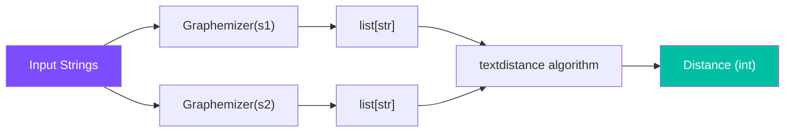

# Distance Functions

Grapheme-aware string distance functions that correctly measure edit distances over visual character units rather than raw Unicode code points.

**Module:** `graphemes_plusplus.distance`

## Functions

### `levenshtein(s1: str, s2: str) → int`

Computes the **grapheme-aware Levenshtein distance** (minimum edit distance) between two strings.

```python
levenshtein(s1: str, s2: str) → int
```

| Parameter | Type | Description |
|---|---|---|
| `s1` | `str` | First input string |
| `s2` | `str` | Second input string |
| **Returns** | `int` | Minimum number of grapheme-level insertions, deletions, and substitutions |

```python
>>> from graphemes_plusplus import levenshtein
>>> levenshtein("ஸ்ரீ", "ஸ்ரி")
1
>>> levenshtein("ක්‍රම", "කම")
1
```

> **Why grapheme-aware?**
> Standard Levenshtein on raw Unicode would count `ஸ்ரீ` → `ஸ்ரி` as multiple edits because the underlying code points differ in count. Grapheme-aware Levenshtein correctly identifies this as a single grapheme substitution.
>
>
---

### `hamming(s1: str, s2: str) → int`

Computes the **grapheme-aware Hamming distance** between two strings. Both strings must have the same number of graphemes.

```python
hamming(s1: str, s2: str) → int
```

| Parameter | Type | Description |
|---|---|---|
| `s1` | `str` | First input string |
| `s2" | `str` | Second input string (must have equal grapheme count) |
| **Returns** | `int` | Number of positions where graphemes differ |

```python
>>> from graphemes_plusplus import hamming
>>> hamming("ஸ்ரீ", "ஸ்ரீ")
0
```

> **Equal length required**
> The Hamming distance is only defined for strings with equal numbers of graphemes. If the grapheme counts differ, `textdistance` will handle the mismatch according to its own convention.
>
>
## How It Works

Both functions internally:

1. Create `Graphemizer` instances for each input string
2. Convert to `list[str]` of grapheme clusters
3. Pass these lists to `textdistance` algorithms



## See Also

- [Graphemizer](graphemizer.md) - Creates the grapheme lists used for comparison
- [Metrics](metric.md) - Higher-level evaluation metrics built on distance functions
