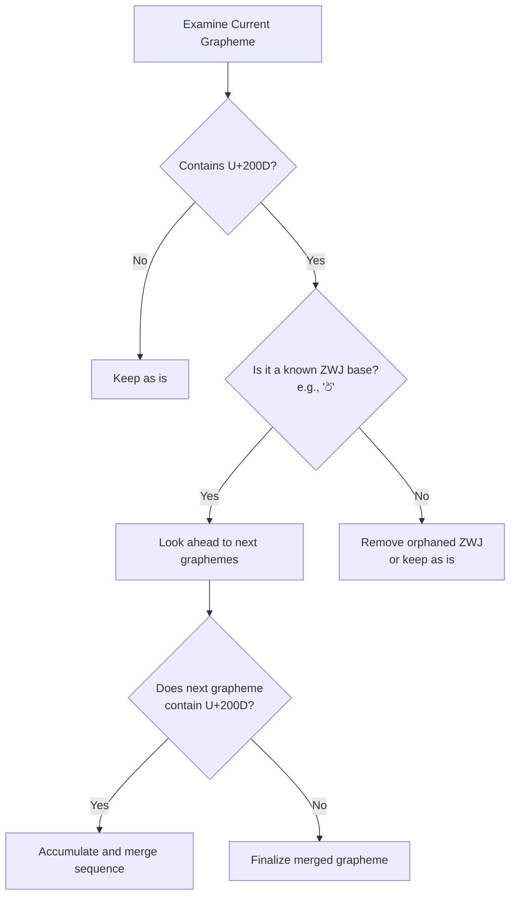

# Sinhala Script Rules

This page explains the theoretical foundation behind the Sinhala grapheme handling and ZWJ logic used in `grapheme-kit`.

This page covers script-specific corrections layered on top of the universal grapheme engine described in [System Architecture](system-architecture.md) -- segmentation, metrics, and distance all work on any language; this page is about the extra accuracy `grapheme-kit` adds specifically for Sinhala.

## Sinhala Script Anatomy

The Sinhala script block in Unicode ranges from `U+0D80` to `U+0DFF`. Similar to Tamil, it is an abugida where consonants possess an inherent vowel ("a" or "ä"), which is altered using dependent vowel signs.

### Vowel Sign Handling

In Sinhala, independent vowels have corresponding dependent signs (accent symbols). For instance, the independent vowel `ආ` corresponds to the dependent sign `ා`.

Our `Decomposer` and `Composer` utilities rely on an internal mapping to seamlessly switch between the full phonetic representation and the visual cluster:

| Independent Vowel | Dependent Sign |
| --- | --- |
| `අ` | (None, inherent) |
| `ආ` | `ා` |
| `ඇ` | `ැ` |
| `ඊ` | `ී` |

*(This is a partial list. `grapheme-kit` handles all 18 mapped vowels).*

## Zero-Width Joiner (ZWJ)

Sinhala heavily utilizes the **Zero-Width Joiner (ZWJ, `U+200D`)**. The ZWJ is an invisible Unicode character that tells the text rendering engine to visually merge the preceding and succeeding characters into a single conjunct or special form.

Without a ZWJ, `ක්` + `ර` renders side-by-side as `ක්ර`.  
With a ZWJ, `ක්` + `ZWJ` + `ර` renders as the conjunct `ක්‍ර`.

Standard grapheme splitters often break strings at the ZWJ boundary, which destroys the visual grouping.

### ZWJ Cluster Merging Logic

`grapheme-kit` maintains a list of valid Sinhala ZWJ sequences (e.g., `ක්ව්`, `ක්ෂ්`, `ර්`). When the `GraphemeSplitter` encounters a ZWJ, it looks ahead to see if the adjacent characters form a known sequence.

## Internal Normalization Rules

Sinhala text input is particularly susceptible to out-of-order typing because some vowel markers visually wrap around the consonant.

The internal `Normalizer` maintains a "confusion set" to fix these typological errors before segmentation. For example:
- `ේා` is normalized to `ෝ`
- `්ො` is normalized to `ෝ`
- `ෟෙ` is normalized to `ෞ`

This ensures that the `Graphemizer` always operates on predictable, canonically correct code point sequences, regardless of how the user typed the text.
