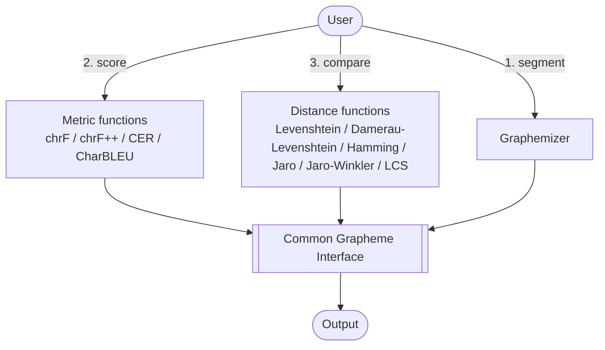
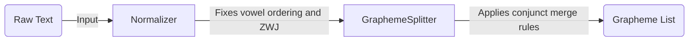

# System Architecture

This page describes the system-level architecture of `grapheme-kit`: the ways a user can interact with the library, and how each of those interactions is built on the same underlying grapheme engine.

## Three Ways to Interact With the System

There are exactly three things a user can ask the system for:

1. **Graphemes** — segment raw text into grapheme clusters.
2. **A metric** — a grapheme-aware evaluation score (chrF, chrF++, CER, CharBLEU) between a hypothesis and a reference.
3. **A distance** — a grapheme-aware edit distance or similarity score (Levenshtein, Damerau-Levenshtein, Hamming, Jaro, Jaro-Winkler, Longest Common Subsequence) between two strings.

All three requests are entry points into the same system, and all three route through one common grapheme interface before producing output — a metric or a distance is never computed directly on raw text; it is always computed on the grapheme clusters that text decomposes into.

Every branch — segmentation, metrics, distance — ultimately calls the same grapheme-splitting logic. A metric function doesn't reimplement segmentation; it calls the `Graphemizer`, gets grapheme clusters back, and computes its score over those clusters. This is why grapheme-aware behavior is consistent everywhere in the library: there is exactly one place that decides what counts as "one character."

## Two Interfaces, One Engine

The three interactions above are exposed through two interfaces:

- **Python API** — `import graphemes_plusplus` in a script, notebook, or larger pipeline.
- **Command Line** (`gpp`, alias for `graphemes-plusplus`) — the same operations (`graphemize`, `distance`, `evaluate`, `decompose`, `compose`, `normalize`), plus file/stdin input and JSON output, for use outside Python. See [Command Line Usage](../how-to/cli-usage.md).

Both interfaces are thin wrappers over the same engine — a Python API call and the equivalent CLI invocation always produce the same numbers.

## Internal Pipeline (Segmentation Detail)

Zooming into the Graphemizer step specifically: raw text passes through two internal stages before it becomes a grapheme list.

This internal detail matters if you're debugging segmentation behavior, but from the system-level view above, it's all folded into the single "Graphemizer" box that every other feature depends on.
