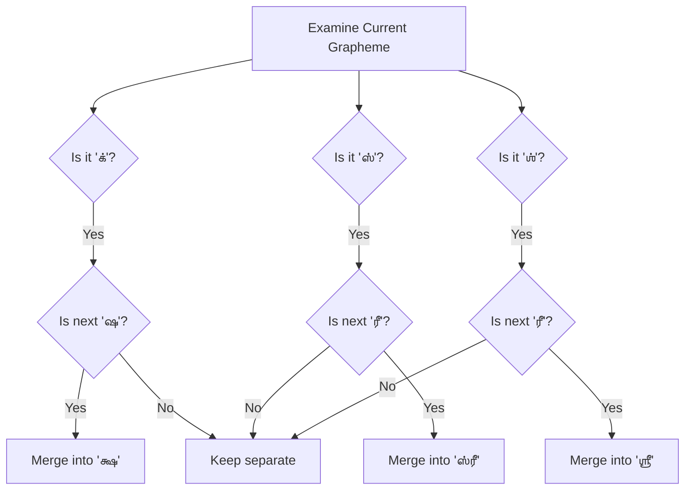

# Tamil Script Rules

This page explains the theoretical foundation behind the Tamil grapheme handling and conjunct logic used in `grapheme-kit`.

This page covers script-specific corrections layered on top of the universal grapheme engine described in [System Architecture](system-architecture.md) -- segmentation, metrics, and distance all work on any language; this page is about the extra accuracy `grapheme-kit` adds specifically for Tamil.

## Tamil Script Anatomy

The Tamil script block in Unicode ranges from `U+0B80` to `U+0BFF`. The script consists of:

- **Vowels (உயிர் - Uyir)**: E.g., அ, ஆ, இ
- **Consonants (மெய் - Mei)**: Base consonants with an inherent "a" vowel.
- **Vowel Markers**: Dependent symbols attached to consonants to alter their vowel sound.

### The Pulli (்) Mark

The dot placed on top of a Tamil consonant is called the *pulli* (hal or virama in other scripts). Its function is to suppress the inherent "a" vowel of the base consonant.

For example:
- `க` is the consonant "ka".
- Adding the pulli `்` (U+0BCD) makes it `க்` ("k" sound without a vowel).

## Conjunct Formation

Unlike English, some sequences of letters in Tamil merge visually to form an entirely new shape called a conjunct. Standard string iteration separates these components, leading to broken text processing. `grapheme-kit` identifies these patterns and merges them.

### Example: க் + ஷ → க்ஷ

The most common Tamil conjunct is `க்ஷ`. Visually, it is one character. But under the hood, it consists of:

1. `க` (Ka)
2. `்` (Pulli)
3. `ஷ` (Sha)

If you iterate through the text normally, you might get `['க்', 'ஷ']`. Our library merges them into `['க்ஷ']`.

### The `ஸ்ரீ` and `ஶ்ரீ` Clusters

The honorific "Shri" in Tamil (`ஸ்ரீ`) is notoriously problematic in standard Unicode segmentation. It consists of `ஸ்` + `ரீ` (`ஸ` + `்` + `ர` + `ீ`).

Our decision tree ensures that when these specific sequences are encountered, they are kept together:

## Internal Normalization Rules

Before segmentation occurs, the internal `Normalizer` applies several Tamil-specific fixups to handle common typing errors and non-standard encodings:

1. **Reversed Vowel Markers**: Sometimes, users type the dependent vowels in the wrong order visually (e.g., `ாெ` instead of `ொ`). The normalizer corrects this automatically.
2. **ZWNJ Removal**: The Zero-Width Non-Joiner (`U+200C`) is often accidentally inserted and can disrupt segmentation. It is stripped out.
3. **Conditional `ௌ` Merging**: The sequence `ெ` + `ள` is often intended to be the single marker `ௌ`. The normalizer merges them *only* if they are not immediately followed by another vowel-like marker, preventing over-eager merges in valid edge cases.
