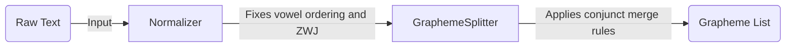

# Introduction

Welcome to the tutorial series on understanding and processing Indic text with `graphemes++`.

## What This Tutorial Covers

This series is structured as a step-by-step guide. Each section focuses on one concept and builds on the previous one. By the end, you will be able to confidently segment, edit, and evaluate Tamil and Sinhala text at the grapheme level.

## What is a Grapheme?

If you have ever processed English text in Python, you are familiar with the concept that a "character" is generally equivalent to a single visual letter. However, this assumption breaks down completely for Indic scripts like Tamil and Sinhala.

To process these scripts correctly, we need to understand the difference between:

- **Code points**: The numeric values assigned by the Unicode Consortium to each symbol.
- **Characters**: A general term, often used interchangeably with code points.
- **Graphemes**: A single *visual* cluster. What a human eye perceives as one letter.

The Tamil word for "hello" is `வணக்கம்`. When Python counts `len("வணக்கம்")`, it returns 8 because it counts code points. But visually and linguistically, this word has only 5 grapheme clusters: `வ`, `ண`, `க்`, `க`, `ம்`.

Standard Python tools operate on *code points*. `graphemes++` operates on *graphemes*.

## The Graphemizer Pipeline

Before jumping into the code, it helps to understand how `graphemes++` thinks internally. When you pass text to the library, it goes through a two-stage pipeline:

1. **Normalizer**: Fixes common typing errors such as reversed vowel marker orders, and applies standard Unicode NFC normalization.
2. **GraphemeSplitter**: Examines the normalized text and applies language-specific look-ahead rules to correctly merge conjunct clusters.

---

**Next:** [Segmenting Tamil Text](segmentation.md)
