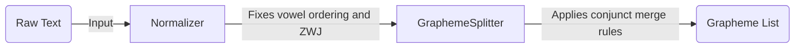

# Introduction

Welcome to the tutorial series on understanding and processing text with `grapheme-kit`.

## What This Tutorial Covers

This series is structured as a step-by-step guide. Each section focuses on one concept and builds on the previous one. By the end, you will be able to confidently segment, edit, and evaluate text at the grapheme level, ensuring fair and accurate NLP model evaluation across diverse languages.

## The Core Problem: Evaluation Fairness

If you use standard string-based metrics to evaluate an NLP model, you are implicitly assuming that a Unicode **code point** is the same thing as a **grapheme** (the visual unit a human reads as "one character").

For English and most Latin-script languages, this assumption holds. For complex scripts like Tamil and Sinhala, it breaks down. One visual character can be built from three or four code points. When standard metrics count code points, they end up misrepresenting the true model performance.

To resolve this, `grapheme-kit` redefines evaluation metrics at the grapheme level. See [System Architecture](../explanation/system-architecture.md) for the top-level details on how this is structured.

## What is a Grapheme?

To process scripts correctly, we must understand the difference between:

- **Code points**: The numeric values assigned by the Unicode Consortium to each symbol.
- **Characters**: A general term, often used interchangeably with code points.
- **Graphemes**: A single *visual* cluster. What a human eye perceives as one letter.

The Tamil word for "hello" is `வணக்கம்`. When Python counts `len("வணக்கம்")`, it returns 8 because it counts code points. But visually and linguistically, this word has only 5 grapheme clusters: `வ`, `ண`, `க்`, `க`, `ம்`.

Standard Python tools operate on *code points*. `grapheme-kit` operates on *graphemes*.

## The Graphemizer Pipeline

Under the hood, `grapheme-kit` processes raw text through a two-stage pipeline:

1. **Normalizer**: Fixes common typing errors such as reversed vowel marker orders, and applies standard Unicode NFC normalization.
2. **GraphemeSplitter**: Examines the normalized text and applies language-specific look-ahead rules to correctly merge conjunct clusters.

---

**Next:** [Measuring Quality with Metrics](metrics.md)
