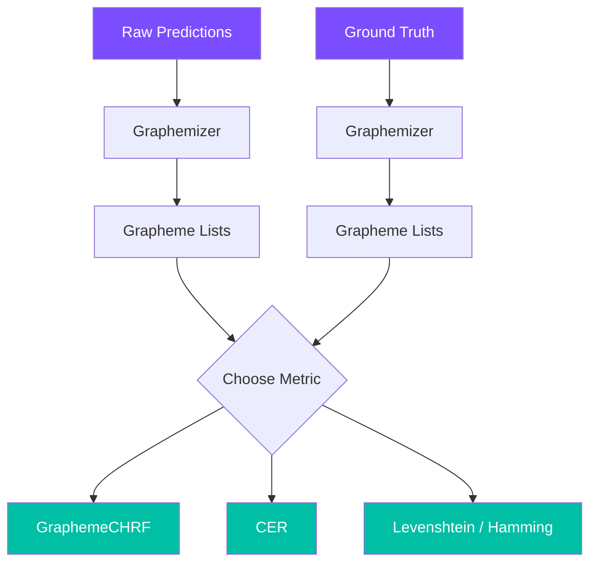

# Evaluation Metrics

A guide to using `graphemes++` evaluation metrics for NLP tasks involving Tamil and Sinhala text, such as machine translation, OCR, and speech recognition.

## Why Grapheme-Level Evaluation?

Standard NLP metrics like chrF and CER operate on Unicode characters. For Indic scripts like Tamil and Sinhala, this leads to **inflated or misleading scores** because:

1. A single visual character may be 2–4 Unicode code points
2. ZWJ sequences are split artificially
3. Conjuncts are counted as multiple "characters"

`graphemes++` solves this by operating at the **grapheme cluster** level.

## GraphemeCHRF

### chrF (Character F-score)

chrF measures n-gram overlap between hypothesis and reference at the character level. `GraphemeCHRF` does this at the **grapheme** level.

```python
from graphemes_plusplus.metric import GraphemeCHRF

chrf = GraphemeCHRF()

# Corpus-level scoring
score = chrf.corpus_score(
    ["வணக்கம் உலகம்"],           # hypotheses
    [["வணக்கம் உலகம்"]]          # references
)
print(f"chrF: {score.score:.2f}")  # 100.00
```

### chrF++ (with word n-grams)

chrF++ extends chrF by including word-level n-grams, which captures word order information:

```python
chrf_pp = GraphemeCHRF(word_order=2)

# Word order differences are penalized
ref = ["இன்று வானிலை மிகவும் அழகாக இருக்கிறது"]
hyp = ["இருக்கிறது அழகாக மிகவும் வானிலை இன்று"]

score_chrf = GraphemeCHRF().corpus_score(hyp, [ref])
score_chrfpp = chrf_pp.corpus_score(hyp, [ref])

print(f"chrF:  {score_chrf.score:.2f}")   # Grapheme overlap only
print(f"chrF++: {score_chrfpp.score:.2f}") # + word order penalty
```

### Multi-Reference Evaluation

`GraphemeCHRF` supports multiple references (takes the best match):

```python
chrf = GraphemeCHRF()
score = chrf.corpus_score(
    ["வணக்கம்"],
    [["வணக்கம்", "நமஸ்காரம்"]]  # two valid references
)
```

## CER (Character Error Rate)

CER measures the grapheme-level edit distance normalized by reference length:

```python
from graphemes_plusplus.metric import CER

# Perfect match
print(CER("வணக்கம்", "வணக்கம்"))  # 0.0

# Complete mismatch
print(CER("", "வணக்கம்"))         # 1.0

# Partial match
cer = CER("வணக்கம", "வணக்கம்")
print(f"CER: {cer:.4f}")
```

### CER Formula

$$
\text{CER} = \frac{\text{Levenshtein}(\text{hypothesis}, \text{reference})}{|\text{reference graphemes}|}
$$

## Choosing the Right Metric

| Metric | Best For | Pros | Cons |
|---|---|---|---|
| **chrF** | Translation quality | No tokenization needed, correlates well with human judgment | Ignores word order |
| **chrF++** | Translation quality | Captures word order via word n-grams | Slightly more complex |
| **CER** | OCR, ASR | Simple, intuitive interpretation | Doesn't capture reordering |
| **Levenshtein** | String similarity | Raw edit distance | Not normalized |
| **Hamming** | Fixed-length comparison | Fast | Requires equal length |

## Practical Workflow



> **For machine translation**
> Use **chrF++** (`word_order=2`) for the best correlation with human judgment on Tamil and Sinhala translation tasks.
>
>
> **For OCR and ASR**
> Use **CER** for character-level accuracy measurement. It gives a single number between 0 (perfect) and potentially > 1 (very poor).
>
