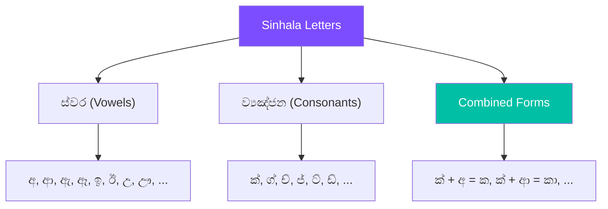

# Sinhala Scripts

A practical guide to using `graphemes++` with Sinhala (සිංහල) text.

## Why Grapheme-Aware Processing Matters for Sinhala

Sinhala uses **Zero Width Joiner (ZWJ)** characters to form conjunct consonants. These invisible characters connect multiple consonants into a single visual glyph:

> <div class="script-text">ක්‍රි
1 grapheme · Multiple Unicode code points (with ZWJ)
</div>

## Sinhala Grapheme Segmentation

### Basic Examples

```python
from graphemes_plusplus import Graphemizer

# Simple Sinhala text
g = Graphemizer("සිංහල")
print(g.graphemes)
# ['සිං', 'හ', 'ල']

# ZWJ conjuncts
g = Graphemizer("ක්‍රිකට්")
print(g.graphemes)
# ['ක්‍රි', 'ක', 'ට්']
```

### ZWJ Handling

The standard `grapheme` library may split Sinhala ZWJ conjuncts incorrectly. `graphemes++` detects ZWJ (`U+200D`) sequences and merges them:

```python
# ZWJ conjuncts are kept as single graphemes
g = Graphemizer("ක්‍රීඩා")
print(g.graphemes)
# ['ක්‍රී', 'ඩා'] — correctly merged
```

> **Zero Width Joiner (ZWJ)**
> The ZWJ character (`U+200D`) is invisible but linguistically significant in Sinhala. It tells the rendering engine to form a conjunct ligature. `graphemes++` respects this and keeps ZWJ-connected characters together.
>
>
## Sinhala Decomposition

Decompose Sinhala graphemes into consonant base + vowel:

```python
from graphemes_plusplus import decompose, compose

# Decompose
print(decompose("ක"))    # ක් + අ
print(decompose("කා"))   # ක් + ආ
print(decompose("කැ"))   # ක් + ඇ

# Compose back
print(compose(decompose("කා")))  # කා
```

### The Sinhala Phonetic System



## Sinhala Normalization

The `Normalizer` fixes common Sinhala encoding confusables:

| Incorrect Sequence | Corrected | Description |
|---|---|---|
| `ේා` | `ෝ` | Kombuwa + aela-pilla → Kombu deka-pilla |
| `්ො` | `ෝ` | Hal + kombuva-with-aela-pilla |
| `ෟෙ` | `ෞ` | Gayanukitta confusion |
| `ෙ‌ෙ` | `ෛ` | Double kombuva |
| `්ෙ` | `ේ` | Hal + kombuva → Kombu deka-pilla |

```python
from graphemes_plusplus.utils import Normalizer

n = Normalizer()
# All variant encodings produce the correct form
n.normalize("ේා")   # → ෝ
n.normalize("්ො")   # → ෝ
```

## Sinhala Distance Metrics

```python
from graphemes_plusplus import levenshtein, hamming

print(levenshtein("ක්‍රම", "කම"))       # Grapheme-aware edit distance
print(hamming("ස්වාගතයි", "ස්වාගතයි"))  # 0 (identical)
```
