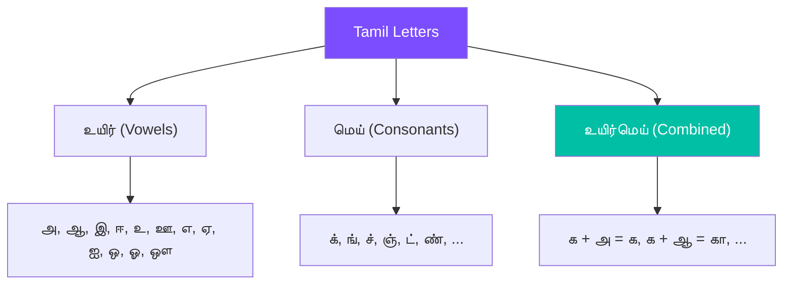

# Tamil Scripts

A practical guide to using `graphemes++` with Tamil (தமிழ்) text.

## Why Grapheme-Aware Processing Matters for Tamil

Tamil has a complex writing system where a single visual character can consist of multiple Unicode code points:

> <div class="script-text">ஸ்ரீ
1 grapheme · 4 Unicode code points
</div>

| Representation | Count | Result |
|---|---|---|
| `len("ஸ்ரீ")` | 4 | Unicode code points |
| `len(list("ஸ்ரீ"))` | 4 | Individual characters |
| `len(Graphemizer("ஸ்ரீ"))` | **1** | ✅ Correct grapheme count |

## Tamil Grapheme Segmentation

### Basic Examples

```python
from graphemes_plusplus import Graphemizer

# Simple word
g = Graphemizer("வணக்கம்")
print(g.graphemes)
# ['வ', 'ண', 'க்', 'க', 'ம்']

# Complex conjunct: க்ஷ
g = Graphemizer("அக்ஷரம்")
print(g.graphemes)
# ['அ', 'க்ஷ', 'ர', 'ம்']

# Sri marker: ஸ்ரீ
g = Graphemizer("ஸ்ரீமான்")
print(g.graphemes)
# ['ஸ்ரீ', 'மா', 'ன்']
```

### Special Tamil Conjuncts

`graphemes++` handles these Tamil-specific conjuncts that the standard `grapheme` library splits incorrectly:

| Conjunct | Components | `graphemes++` | Standard `grapheme` |
|---|---|---|---|
| க்ஷ | க் + ஷ | ✅ Single grapheme | ❌ Split into 2 |
| ஸ்ரீ | ஸ் + ரீ | ✅ Single grapheme | ❌ Split into 2 |
| ஶ்ரீ | ஶ் + ரீ | ✅ Single grapheme | ❌ Split into 2 |

## Tamil Decomposition

Decompose Tamil graphemes into their phonetic components (mei + uyir):

```python
from graphemes_plusplus import decompose, compose

# Decompose: உயிர்மெய் → மெய் + உயிர்
print(decompose("கா"))   # க் + ஆ
print(decompose("தி"))   # த் + இ
print(decompose("பூ"))   # ப் + ஊ

# Compose back
print(compose(decompose("கா")))  # கா
```

### The Tamil Phonetic System



## Tamil Normalization

The `Normalizer` automatically fixes common Tamil encoding issues:

```python
from graphemes_plusplus.utils import Normalizer

n = Normalizer()

# Fix reversed vowel orders
n.normalize("ாெ")  # → ொ
n.normalize("ாே")  # → ோ

# Fix incorrect sequences
n.normalize("ா்")  # → ர்
n.normalize("ாி")  # → ரி
```

> **Normalization is automatic**
> When you use `Graphemizer`, normalization is applied automatically. These examples show the `Normalizer` for educational purposes.
>
>
## Tamil Distance Metrics

```python
from graphemes_plusplus import levenshtein

# Single grapheme substitution
print(levenshtein("ஸ்ரீ", "ஸ்ரி"))  # 1 (correct!)

# Standard Levenshtein would give a larger number due to
# code point differences, not grapheme differences
```
